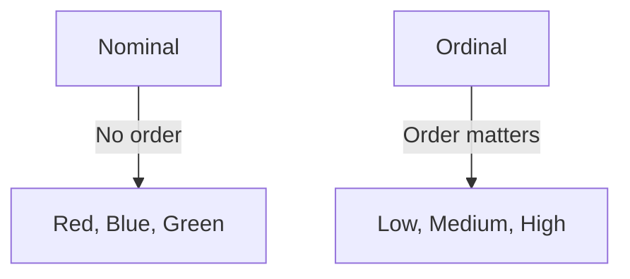

# Stage 1: Foundations of Statistics

A detailed training module covering the fundamental concepts of statistics with definitions, formulas, tables, and practical examples.

---

## 1. What is Statistics?

Statistics involves collecting, organizing, analyzing, interpreting, and presenting data.

- **Descriptive Statistics:**  
  Summarizes or describes the characteristics of a dataset.  
  *Example:* Calculating average exam scores, or visualizing data with histograms.

- **Inferential Statistics:**  
  Uses sample data to make inferences or predictions about a larger population.  
  *Example:* Predicting election outcomes from poll samples.

---

## 2. Types of Variables

Variables represent characteristics or measurements.

| Variable Type  | Description                              | Example                   |
|----------------|------------------------------------------|---------------------------|
| **Categorical**  | Categories or groups without numeric meaning | Gender (Male, Female), Colors (Red, Green) |
| **Numerical**    | Quantitative measurements expressed numerically | Age (years), Height (cm), Temperature (°C) |

---

## 3. Scales of Measurement

Understanding the scale guides data analysis choices.

| Scale     | Description                                  | Key Features                              | Examples                     |
|-----------|----------------------------------------------|--------------------------------------------|------------------------------|
| **Nominal** | Categories without order or ranking          | Labels only, no mathematical operations     | Eye color, Nationality       |
| **Ordinal** | Categories with a meaningful order           | Ordered but unequal intervals                | Education level (High school, Bachelor, Master) |
| **Interval**| Numeric scale with equal intervals, no true zero | Differences meaningful, ratios not meaningful | Temperature (Celsius, Fahrenheit) |
| **Ratio**  | Numeric scale with equal intervals and true zero | Ratios meaningful, zero means absence of quantity | Weight, Length, Time         |

---

### Example: Nominal vs Ordinal

---

## 4. Measures of Central Tendency

### Mean (Arithmetic Average)

$$
\bar{x} = \frac{1}{n} \sum_{i=1}^{n} x_i
$$

- Example: Data = [4, 7, 8, 6, 5]

 
  $$
  \bar{x} = \frac{4 + 7 + 8 + 6 + 5}{5} = \frac{30}{5} = 6
  $$

### Median

- Middle value of ordered data.  
- For odd number of observations, median is the center value.  
- For even, median is average of two middle values.

Example: Data = [3, 5, 7, 9, 11] → Median = 7

Example: Data = [3, 5, 7, 9] → Median = (5 + 7) / 2 = 6

### Mode

- Most frequently occurring value(s).

Example: Data = [2, 4, 4, 5, 6] → Mode = 4

---

## 5. Measures of Dispersion

### Range

$$
\text{Range} = x_{\text{max}} - x_{\text{min}}
$$

Example: Data = [3, 5, 7, 9] → Range = 9 - 3 = 6

### Variance

$$
s^2 = \frac{1}{n - 1} \sum_{i=1}^n (x_i - \bar{x})^2
$$

### Standard Deviation

$$
s = \sqrt{\frac{1}{n - 1} \sum_{i=1}^n (x_i - \bar{x})^2}
$$

Example: For data [2, 4, 4, 4, 5, 5, 7, 9], mean $$\( \bar{x} = 5 \)$$

### Interquartile Range (IQR)

$$
IQR = Q_3 - Q_1
$$

- $$\(Q_1\)$$: 25th percentile (lower quartile)  
- $$\(Q_3\)$$: 75th percentile (upper quartile)

---

## 6. Data Types: Discrete vs Continuous

| Data Type  | Description                                      | Example                          |
|------------|--------------------------------------------------|----------------------------------|
| **Discrete**  | Countable, distinct values (usually integers)   | Number of books, number of cars  |
| **Continuous**| Any value within a range (including decimals)   | Height, weight, time, temperature |

---

## 7. Summary Table of Key Concepts

| Concept                  | Description                              | Formula / Notes                                  |
|--------------------------|------------------------------------------|--------------------------------------------------|
| **Mean**                 | Average value                            | $$\bar{x} = \frac{1}{n} \sum x_i$$             |
| **Median**               | Middle value                             | Sort data, pick center                           |
| **Mode**                 | Most frequent value                      | Can be multiple or none                          |
| **Range**                | Difference between max and min           | $$x_{\text{max}} - x_{\text{min}}$$             |
| **Variance**             | Average squared deviation                | $$s^2 = \frac{1}{n-1} \sum (x_i - \bar{x})^2$$ |
| **Standard Deviation**   | Spread of values from mean               | $$s = \sqrt{\frac{1}{n - 1} \sum (x_i - \bar{x})^2}$$ |
| **IQR**                  | Middle 50% range                         | $$Q_3 - Q_1$$                                  |
| **Nominal Scale**        | Categories, no order                     | Labels                                           |
| **Ordinal Scale**        | Categories with order                    | Ranks                                            |
| **Interval Scale**       | Equal intervals, no true zero            | Temperature scales                               |
| **Ratio Scale**          | Equal intervals, true zero               | Height, weight                                   |
| **Discrete Data**        | Countable                                | Integers                                         |
| **Continuous Data**      | Measurable, any value                    | Real numbers                                     |

---

## 8. Practice Questions

1. Identify the scale of measurement for the following:  
   - Temperature in Fahrenheit  
   - Customer satisfaction ratings (Poor, Average, Excellent)  
   - Eye color  
   - Age in years

2. Calculate the mean, median, and mode for the dataset: [3, 7, 7, 2, 9, 4, 7]

3. Find the range and standard deviation for the data: [5, 8, 12, 7, 10]

---

# End of Stage 1: Foundations of Statistics
